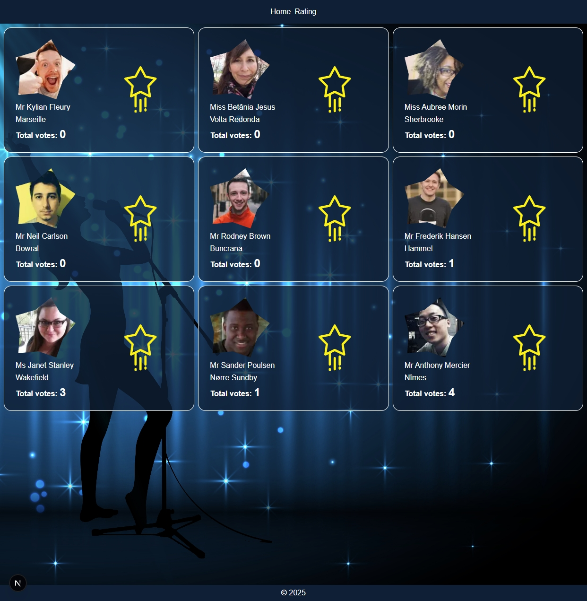

# 🇺🇸 America's Got Talent — Audience Voting App

Веб-приложение, позволяющее зрителям голосовать за участников шоу "America's Got Talent" в реальном времени.

---

## 🚀 Demo

[Открыть приложение](http://localhost:3000)

---

## 🧠 Особенности

- 📊 **Реалтайм голосование**
- 👤 Просмотр участников с аватарками
- 🔢 Сортировка рейтинга по количеству голосов
- 🔁 Плавная перестановка участников при смене рейтинга (FLIP-анимация)
- 🧪 Поддержка юнит-тестов (Jest + Testing Library)

---

## 🧱 Технологии

- [Next.js 15](https://nextjs.org/)
- [React 19](https://react.dev/)
- [Redux Toolkit](https://redux-toolkit.js.org/)
- [Sass](https://sass-lang.com/)
- [Socket.IO](https://socket.io/)
- [Lodash](https://lodash.com/)
- [react-flip-toolkit](https://github.com/aholachek/react-flip-toolkit) (анимация перестановки)
- [@svgr/webpack](https://react-svgr.com/docs/next/) (импорт SVG как компонентов)

---

## Билд и прод-запуск

- yarn build
- yarn start
- yarn dev
